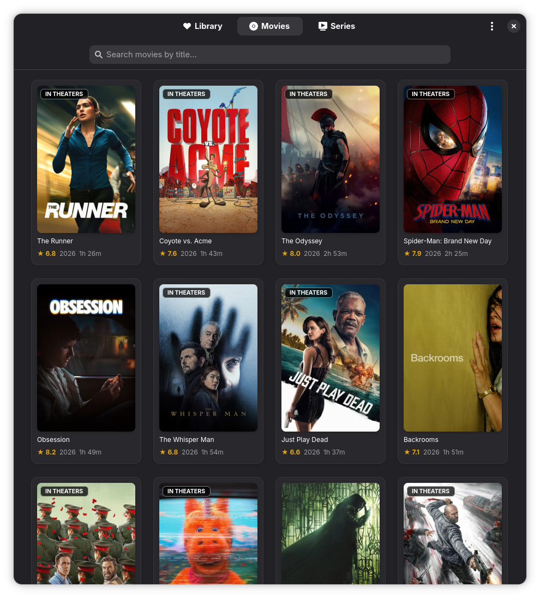
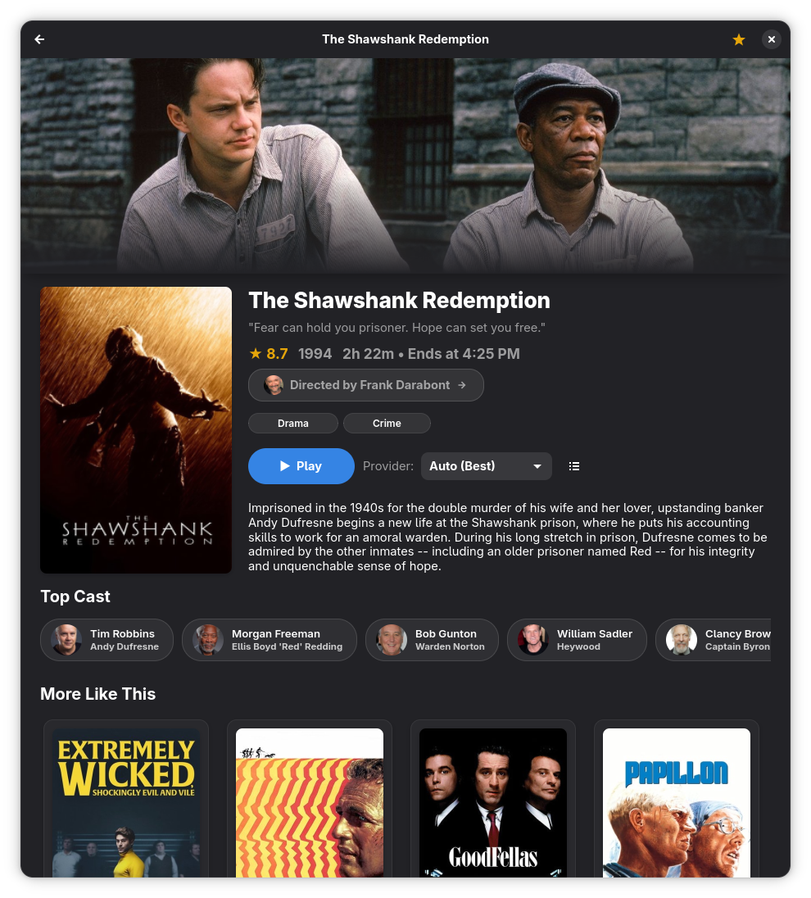
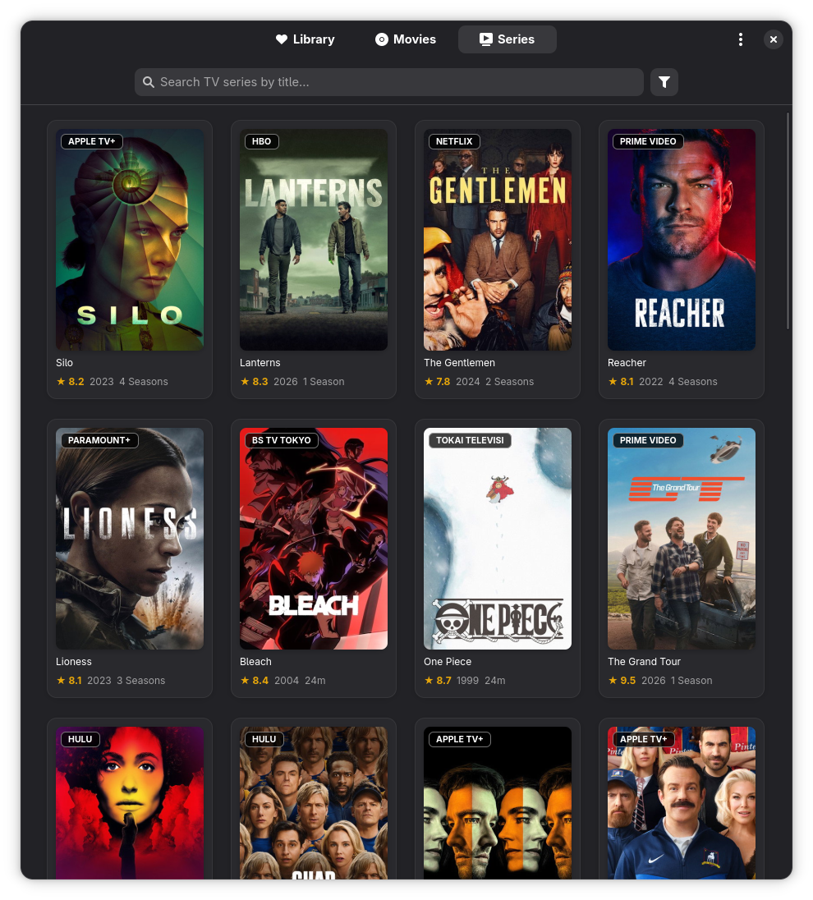
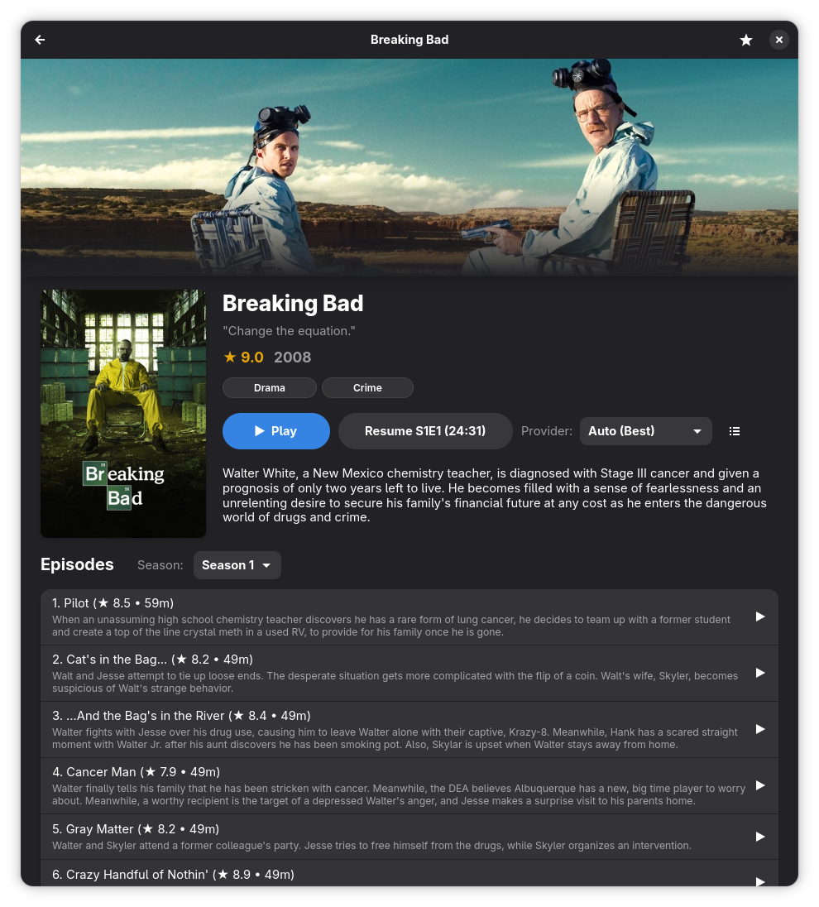
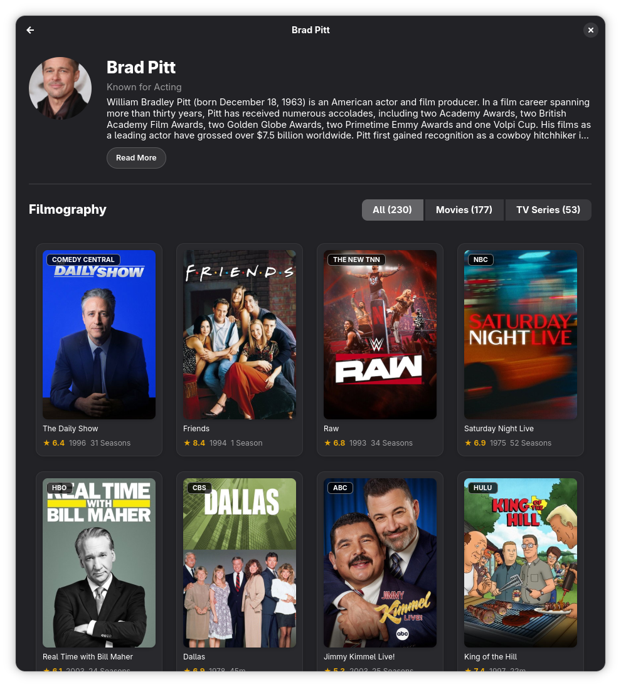
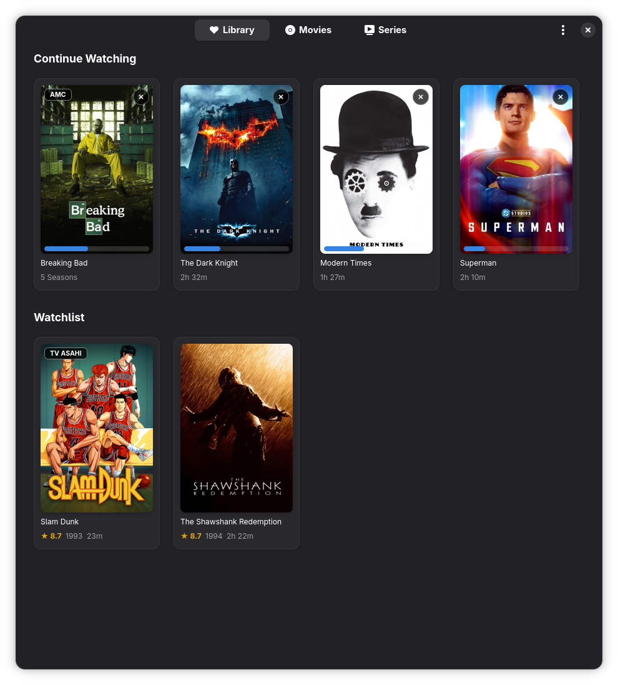
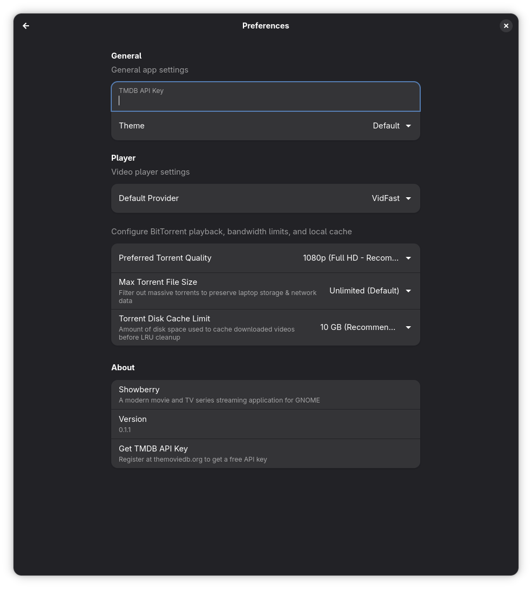

<div align="center">
  
  <h1>Showberry</h1>
  <p><strong>A modern, native, and hardware-accelerated movie and TV series streaming application for GNOME.</strong></p>

  <p>
    <a href="https://github.com/Dackerie/showberry/actions/workflows/ci.yml"></a>
    <a href="https://github.com/Dackerie/showberry/blob/master/LICENSE"></a>
    <a href="https://gitlab.gnome.org/GNOME/libadwaita"></a>
    <a href="https://github.com/Dackerie/showberry/releases/latest"></a>
    <a href="https://github.com/Dackerie/showberry/releases/latest"></a>
    
  </p>
</div>

---

## 📖 Overview

**Showberry** is an elegant streaming client engineered from the ground up for the modern Linux desktop. Built with **Python 3**, **GTK 4**, and **Libadwaita**, it adheres strictly to the GNOME Human Interface Guidelines (HIG) to deliver a seamless, responsive, and tactile media consumption experience.

Showberry unifies discovery, metadata, scraping, and high-performance playback into a unified workflow:
- Instant discovery powered by **The Movie Database (TMDB)** with asynchronous backdrop and poster prefetching.
- High-speed playback via direct **libmpv** OpenGL rendering (`Gtk.GLArea`), avoiding Vulkan swapchain stalls.
- Dual streaming backend: multi-source direct HTTP scrapers with anti-bot TLS emulation alongside sequential **BitTorrent P2P** streaming with local ring buffering and persistent piece caching.
- Frictionless keyboard-driven navigation, directional focus handling, and comprehensive subtitle synchronization.

---

## 📸 Screenshots

| Movies Discovery & Badges | Movie Details & Director Chip |
| :---: | :---: |
| [](data/screenshots/02-movies.png) | [](data/screenshots/03-movie-details.png) |

| TV Series Catalogue | Seasons & Episodes |
| :---: | :---: |
| [](data/screenshots/04-series.png) | [](data/screenshots/05-series-details.png) |

| Cast & Director Filmography | Library & Continue Watching |
| :---: | :---: |
| [](data/screenshots/06-person.png) | [](data/screenshots/01-library.png) |

| App Preferences |
| :---: |
| [](data/screenshots/07-preferences.png) |

---

## ✨ Features

- **Adaptive GNOME Interface**: Native `Adw.NavigationView` navigation hierarchy with smooth transition animations, responsive window breakpoint bins, and unified dark/light theme integration.
- **Hardware-Accelerated MPV Playback**: Low-latency video presentation rendered directly via OpenGL shaders (`GSK_RENDERER=gl`), zero-copy buffer sharing, and full hardware decoding (VA-API / NVDEC).
- **Sequential BitTorrent Streaming**: Instant playback of magnet links and torrent swarms using **libtorrent-rasterbar**. Downloads video pieces sequentially, prioritizes file header/atom metadata, serves range requests through an internal threaded HTTP bridge, and automatically prunes local disk cache according to user preferences.
- **Continuous Resume & Continuity**: Automatically preserves exact playback timestamps, audio tracks, and the specific torrent release (`infoHash` and file index) inside a local SQLite database so resuming cached releases is instantaneous.
- **Advanced Catalogue Filter & Sort**: Interactive discovery popover for Movies and Series enabling multi-faceted filtering by genre, release decade/year, original language, release status, and sorting by Popularity, Rating (with minimum vote count thresholds to prevent niche distortions), Release Date, or Vote Count.
- **Cast & Director Filmographies**: Dedicated `PersonPage` with high-resolution profile imagery, full biographical summary with line-clamped expander pill button, and categorized filmography tabs (`All`, `Movies`, `TV Series`) annotated with work counts.
- **Interactive Director & Creator Navigation**: Clickable `"Directed by <Name> ❯"` and `"Created by <Name> ❯"` chips directly on movie and TV series overview pages for instant one-click filmography browsing.
- **Contextual Release Badges**: Clear visual card badges including `UPCOMING` (blue) for unreleased media, `IN THEATERS` (green) for active theatrical runs, `DIRECTOR` (purple) for directorial credits in filmographies, and streaming network logos for TV series.
- **Direct Multi-Source Scrapers**: Integrated streaming resolvers (VidFast, CineSrc, SuperEmbed, VidKing, etc.) featuring TLS fingerprint emulation via `curl-impersonate` and real-time HEAD health checks.
- **Smart Subtitle Engine**: Integrated OpenSubtitles lookup with auto-detection, custom delay synchronization (`z`/`x`), and live font adjustment.
- **Keyboard-First Workflow**: Seamless 4-way arrow key movement across card grids, tabs, bio expander, and navigation back stacks (`Esc` / `Backspace`), alongside standard media playback hotkeys and quick modal access (`t` for streams, `s` for subtitles, `i` for buffer telemetry).

---

## ⌨️ Keyboard Shortcuts

### Player Hotkeys
| Key | Action |
| :--- | :--- |
| `Space` / `k` | Play / Pause |
| `Left` / `Right` | Seek backward / forward 10 seconds |
| `Shift` + `Left` / `Right` | Seek backward / forward 1 minute |
| `Up` / `Down` | Volume up / down (5%) |
| `m` | Toggle Mute |
| `Shift` + `N` | Play Next Episode (TV Series) |
| `a` | Cycle Audio Track |
| `[` / `]` | Decrease / Increase Playback Speed (-0.25x / +0.25x) |
| `r` / `0` | Reset Playback Speed to 1.0x (Normal) |
| `w` | Cycle Video Fit / Aspect Ratio (Fit, Fill/Crop, 16:9, 21:9, 4:3) |
| `f` / `F11` | Toggle Fullscreen |
| `c` | Toggle Captions on / off (Defaults to English) |
| `s` | Open Subtitles Menu & Delay Controls |
| `z` / `x` | Subtitle Delay (-100ms / +100ms) |
| `t` | Open Torrent Stream Chooser Dialog |
| `i` | Open Stream Details & Real-Time Buffer Stats |
| `Esc` / `Backspace` | Close Player and return to details |

### Navigation Hotkeys
| Key | Action |
| :--- | :--- |
| `Ctrl + 1` | Switch to Library (History & Watchlist) |
| `Ctrl + 2` | Switch to Movies |
| `Ctrl + 3` | Switch to Series |
| `Ctrl + Tab` / `Ctrl + Shift + Tab` | Next / Previous Tab |
| `Ctrl + F` / `/` | Focus Search Bar |
| `w` | Toggle Watchlist for selected title |
| `Return` | Open selected card |
| `Esc` / `Backspace` | Pop page back to previous view |
| `Up` / `Down` / `Left` / `Right` | Move focus between cards, tabs, and action rows |

---

## 📦 Installation & Running

### 🌟 Recommended: Flatpak (Self-Contained & Sandboxed)

The Flatpak bundle includes the full GNOME 50 runtime, Libadwaita, `libmpv`, `libtorrent-rasterbar`, and all Python dependencies in an isolated sandbox. It automatically registers Showberry in your desktop application launcher.

Run this single command in your terminal to download and install the latest release directly:

```bash
curl -LO https://github.com/Dackerie/showberry/releases/latest/download/io.github.Dackerie.Showberry.flatpak && flatpak install --user -y ./io.github.Dackerie.Showberry.flatpak && rm io.github.Dackerie.Showberry.flatpak
```

Once installed, launch Showberry from your application menu or via terminal:

```bash
flatpak run io.github.Dackerie.Showberry
```

> **Note:** If your system does not already have the GNOME 50 runtime installed, Flatpak will automatically install it during the process.

---

### Option 2: Standalone AppImage (.AppImage)

If you prefer a single portable executable without installing, download and run the AppImage:

```bash
curl -LO https://github.com/Dackerie/showberry/releases/latest/download/Showberry-x86_64.AppImage && chmod +x Showberry-x86_64.AppImage && ./Showberry-x86_64.AppImage
```

> **Note:** Requires host `python3`, `libadwaita-1`, `python3-gi`, and `libmpv` installed on your distribution.

---

### Option 3: Run Directly from Source (Development)

Showberry can also be cloned and executed directly from source:

```bash
git clone https://github.com/Dackerie/showberry.git
cd showberry
./run.sh
```

---

## ⚙️ Dependencies

### Core Runtime
- **Python** >= 3.11
- **GTK 4** (`gtk4`)
- **Libadwaita** (`libadwaita` >= 1.5)
- **PyGObject** (`python-gobject`)
- **MPV & libmpv** (`mpv`)
- **libtorrent-rasterbar** (`libtorrent-rasterbar`)
- **Requests & Pillow** (`python-requests`, `python-pillow`)
- **PyCryptodome** (`python-pycryptodome`)

### Recommended / Optional
- **curl-impersonate** (`python-curl-cffi`): Bypasses Cloudflare anti-bot TLS verification for high-reliability scraping.
- **PyOpenGL**: Hardware-accelerated OpenGL video display.
- **python-mpv**: Direct libmpv Python API bindings.

---

## 📄 License

This project is licensed under the terms of the **GNU General Public License v3.0 or later** ([GPL-3.0-or-later](LICENSE)).

TMDB metadata and imagery provided by [The Movie Database](https://www.themoviedb.org/). This product uses the TMDB API but is not endorsed or certified by TMDB.
