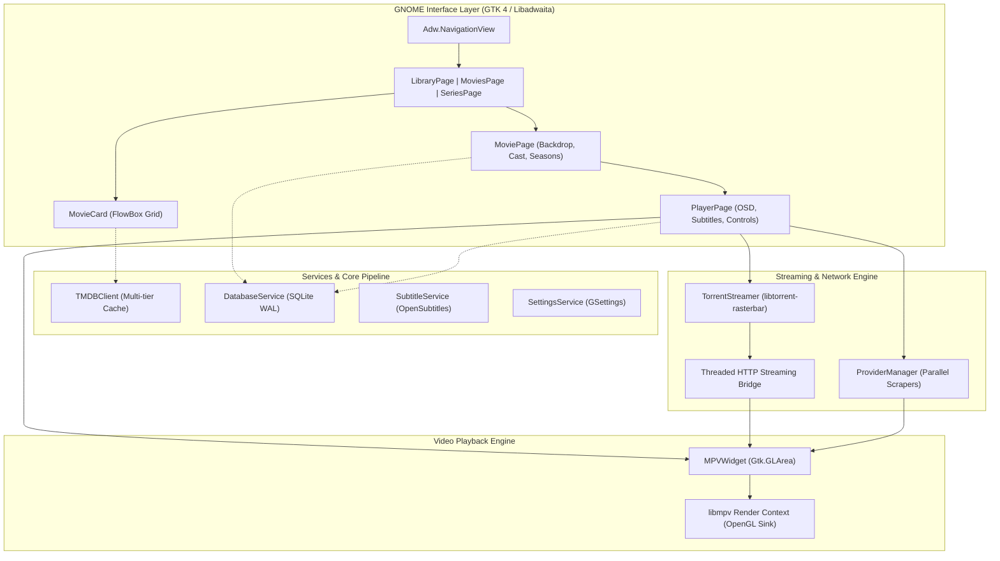

<div align="center">
  
  <h1>Showberry</h1>
  <p><strong>A modern, native, and hardware-accelerated movie and TV series streaming application for GNOME.</strong></p>

  <p>
    <a href="https://github.com/Dackerie/showberry/actions/workflows/ci.yml"></a>
    <a href="https://github.com/Dackerie/showberry/blob/master/LICENSE"></a>
    <a href="https://gitlab.gnome.org/GNOME/libadwaita"></a>
    <a href="https://aur.archlinux.org/packages/showberry"></a>
    <a href="https://flathub.org"></a>
    
  </p>
</div>

---

## 📖 Overview

**Showberry** is an elegant streaming client engineered from the ground up for the modern Linux desktop. Built with **Python 3**, **GTK 4**, and **Libadwaita**, it adheres strictly to the GNOME Human Interface Guidelines (HIG) to deliver a seamless, responsive, and tactile media consumption experience.

Showberry unifies discovery, metadata, scraping, and high-performance playback into a unified workflow:
- Instant discovery powered by **The Movie Database (TMDB)** with asynchronous backdrop and poster prefetching.
- High-speed playback via direct **libmpv** OpenGL rendering (`Gtk.GLArea`), avoiding Vulkan swapchain stalls.
- Dual streaming backend: multi-source direct HTTP scrapers with anti-bot TLS emulation alongside sequential **BitTorrent P2P** streaming with local ring buffering and persistent piece caching.
- Frictionless keyboard-driven navigation, directional focus handling, and comprehensive subtitle synchronization.

---

## 📸 Screenshots

| Movies Discovery | Movie Details & Cast |
| :---: | :---: |
| [](data/screenshots/02-movies.png) | [](data/screenshots/03-movie-details.png) |

| TV Series Catalogue | Seasons & Episodes |
| :---: | :---: |
| [](data/screenshots/04-series.png) | [](data/screenshots/05-series-details.png) |

| Library & Continue Watching | App Preferences |
| :---: | :---: |
| [](data/screenshots/01-library.png) | [](data/screenshots/06-preferences.png) |

---

## ✨ Features

- **Adaptive GNOME Interface**: Native `Adw.NavigationView` navigation hierarchy with smooth transition animations, responsive window breakpoint bins, and unified dark/light theme integration.
- **Hardware-Accelerated MPV Playback**: Low-latency video presentation rendered directly via OpenGL shaders (`GSK_RENDERER=gl`), zero-copy buffer sharing, and full hardware decoding (VA-API / NVDEC).
- **Sequential BitTorrent Streaming**: Instant playback of magnet links and torrent swarms using **libtorrent-rasterbar**. Downloads video pieces sequentially, prioritizes file header/atom metadata, serves range requests through an internal threaded HTTP bridge, and automatically prunes local disk cache according to user preferences.
- **Continuous Resume & Continuity**: Automatically preserves exact playback timestamps, audio tracks, and the specific torrent release (`infoHash` and file index) inside a local SQLite database so resuming cached releases is instantaneous.
- **Direct Multi-Source Scrapers**: Integrated streaming resolvers (VidFast, CineSrc, SuperEmbed, VidKing, etc.) featuring TLS fingerprint emulation via `curl-impersonate` and real-time HEAD health checks.
- **Smart Subtitle Engine**: Integrated OpenSubtitles lookup with auto-detection, custom delay synchronization (`z`/`x`), and live font adjustment.
- **Keyboard-First Workflow**: Directional arrow navigation across card grids, standard media playback hotkeys, and quick modal access (`t` for streams, `s` for subtitles, `i` for buffer telemetry).

---

## 🛠️ Architecture & Technical Details



### Key Technical Highlights:
1. **OpenGL Display Subsystem**: By setting `GSK_RENDERER=gl` and binding `libmpv` through a custom `Gtk.GLArea` proc-address resolution bridge, Showberry bypasses Wayland/Vulkan swapchain deadlocks, providing stutter-free 60fps+ frame presentation.
2. **Sequential Torrent Streaming Bridge**: Rather than waiting for full downloads, `TorrentStreamer` initializes high-priority piece windows around the current read pointer, pre-buffers moov atoms, and exposes a local loopback HTTP server (`http://127.0.0.1:<port>`) supporting HTTP Range requests (`206 Partial Content`).
3. **Database Migration & Resilience**: Implements an automatic zero-loss SQLite schema migration engine that upgrades legacy configurations on startup and enables concurrent read/write operations using SQLite WAL mode.

---

## ⌨️ Keyboard Shortcuts

### Player Hotkeys
| Key | Action |
| :--- | :--- |
| `Space` / `k` | Play / Pause |
| `Left` / `Right` | Seek backward / forward 10 seconds |
| `Shift` + `Left` / `Right` | Seek backward / forward 1 minute |
| `Up` / `Down` | Volume up / down (5%) |
| `m` | Toggle Mute |
| `f` / `F11` | Toggle Fullscreen |
| `s` | Open Subtitles Menu & Delay Controls |
| `z` / `x` | Subtitle Delay (-100ms / +100ms) |
| `t` | Open Torrent Stream Chooser Dialog |
| `i` | Open Stream Details & Real-Time Buffer Stats |
| `Esc` / `Backspace` | Close Player and return to details |

### Navigation Hotkeys
| Key | Action |
| :--- | :--- |
| `Ctrl + 1` | Switch to Library (History & Watchlist) |
| `Ctrl + 2` | Switch to Movies |
| `Ctrl + 3` | Switch to Series |
| `Ctrl + Tab` / `Ctrl + Shift + Tab` | Next / Previous Tab |
| `Ctrl + F` / `/` | Focus Search Bar |
| `w` | Toggle Watchlist for selected title |
| `Return` | Open selected card |

---

## 📦 Installation

### Arch Linux / EndeavourOS (AUR)
Showberry is available on the Arch User Repository:
```bash
yay -S showberry
# or
paru -S showberry
```

### Flatpak (Flathub)
```bash
flatpak install flathub com.github.showberry.Showberry
flatpak run com.github.showberry.Showberry
```

### Run Directly (Development / Portable)
Showberry can be executed without installation:
```bash
git clone https://github.com/Dackerie/showberry.git
cd showberry
./run.sh
```

### Manual Package Build
Build the native Arch package using `makepkg`:
```bash
git clone https://github.com/Dackerie/showberry.git
cd showberry
makepkg -si
```

---

## ⚙️ Dependencies

### Core Runtime
- **Python** >= 3.11
- **GTK 4** (`gtk4`)
- **Libadwaita** (`libadwaita` >= 1.5)
- **PyGObject** (`python-gobject`)
- **MPV & libmpv** (`mpv`)
- **libtorrent-rasterbar** (`libtorrent-rasterbar`)
- **Requests & Pillow** (`python-requests`, `python-pillow`)
- **PyCryptodome** (`python-pycryptodome`)

### Recommended / Optional
- **curl-impersonate** (`python-curl-cffi`): Bypasses Cloudflare anti-bot TLS verification for high-reliability scraping.
- **PyOpenGL**: Hardware-accelerated OpenGL video display.
- **python-mpv**: Direct libmpv Python API bindings.

---

## 📄 License

This project is licensed under the terms of the **GNU General Public License v3.0 or later** ([GPL-3.0-or-later](LICENSE)).

TMDB metadata and imagery provided by [The Movie Database](https://www.themoviedb.org/). This product uses the TMDB API but is not endorsed or certified by TMDB.
