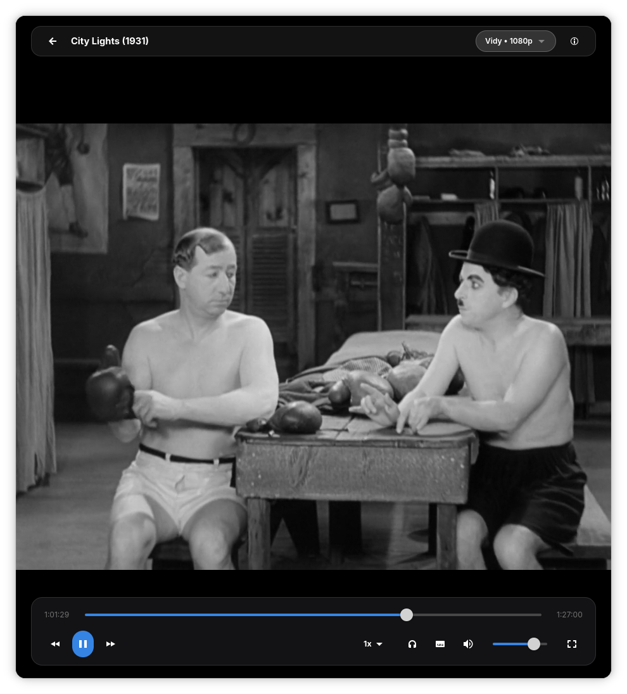
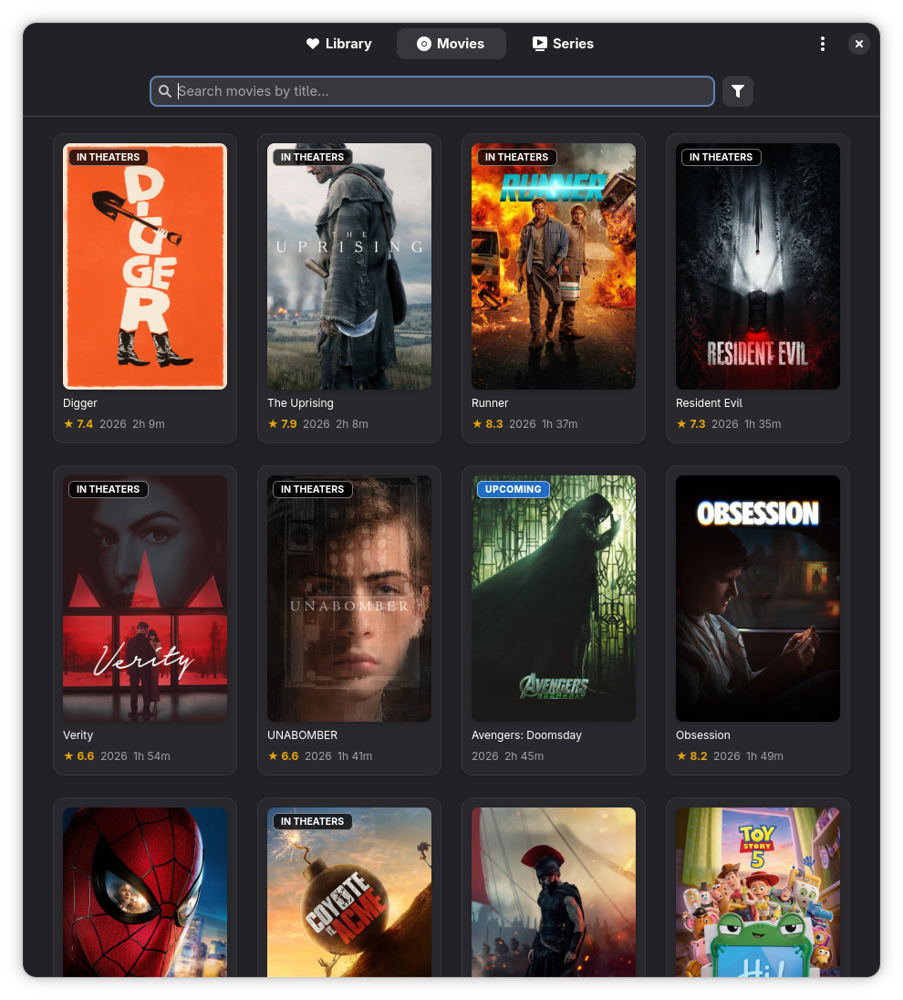
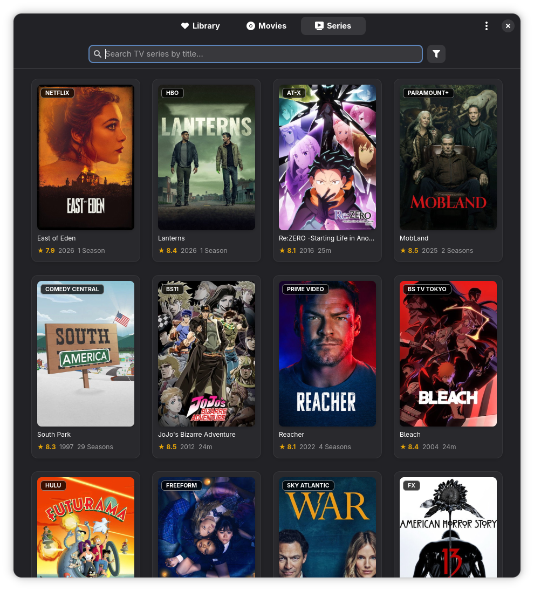
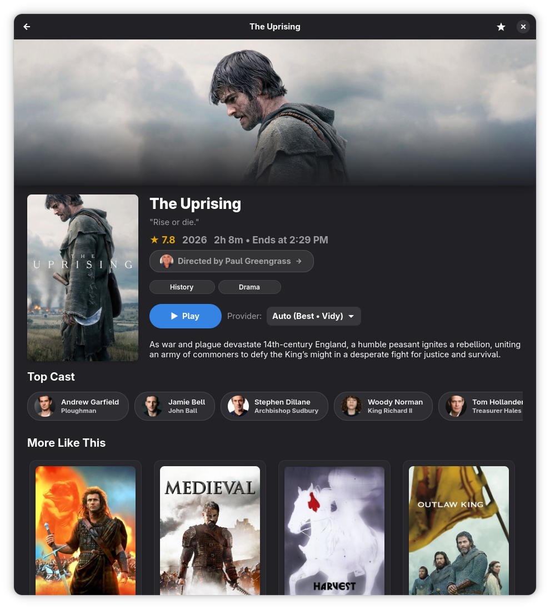
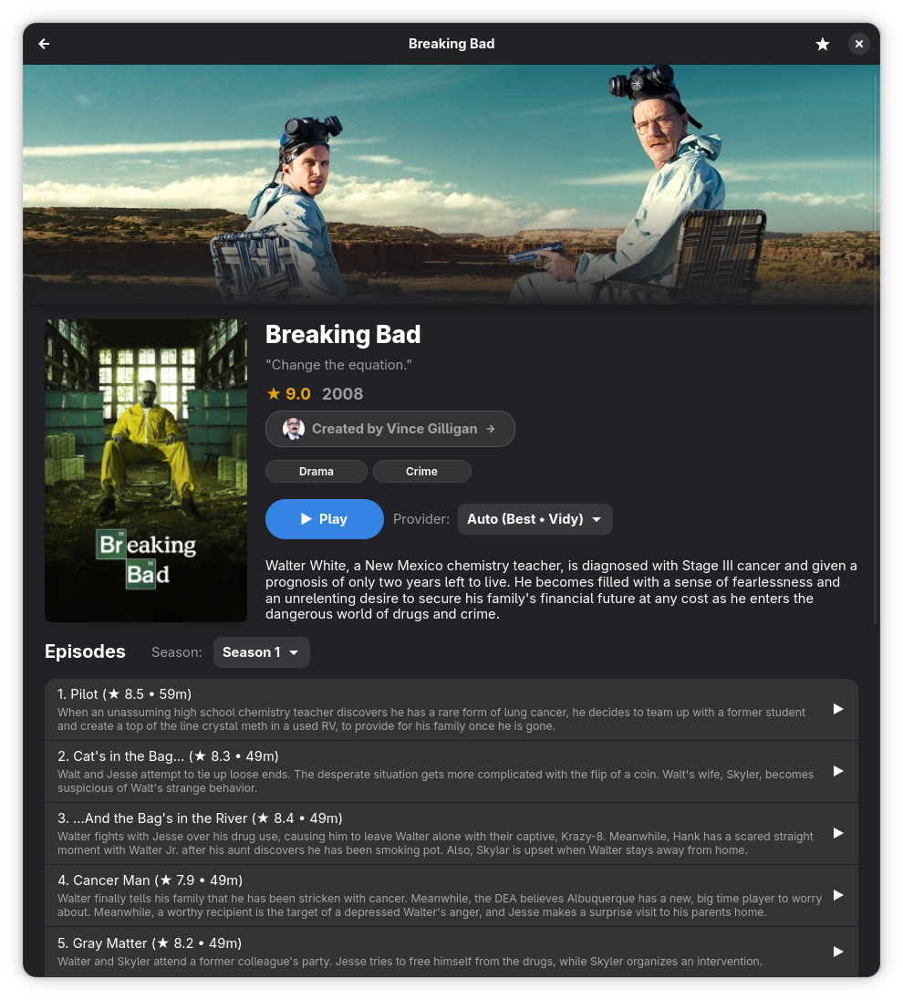
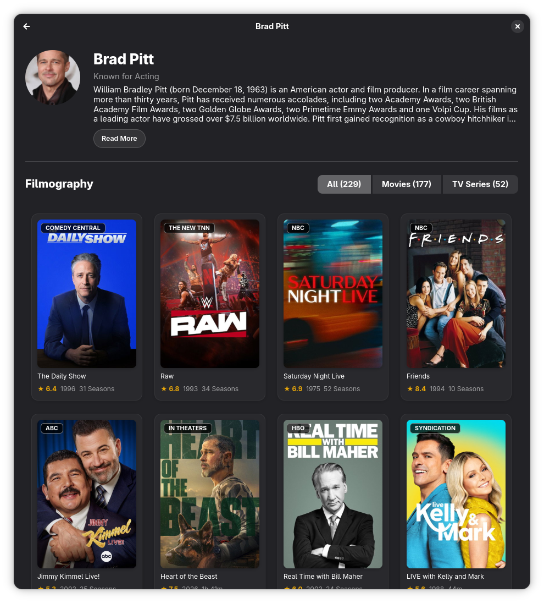
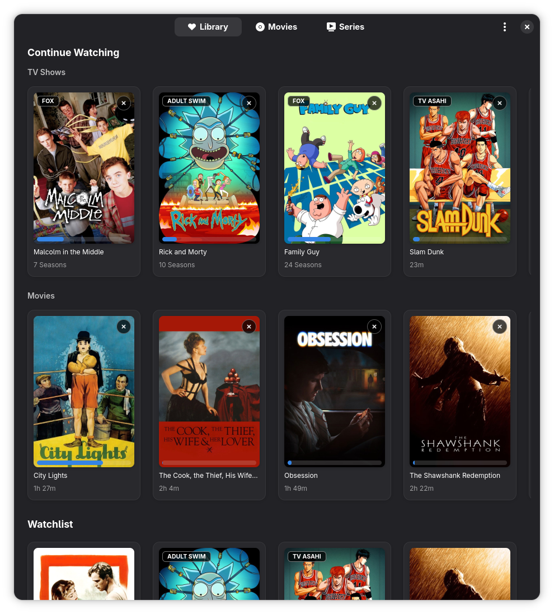
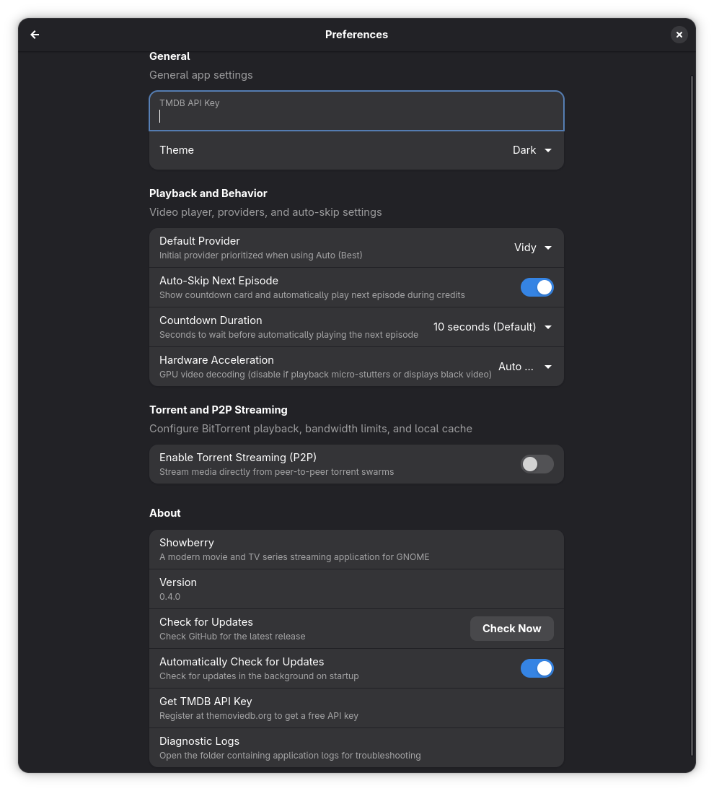

<p align="center">
  
</p>

<h1 align="center">Showberry</h1>

<p align="center">
  <b>A modern, native, and hardware-accelerated cinema and television streaming client.</b><br>
  Built with Python 3, GTK 4, and Libadwaita for GNOME, with first-class packages for Linux, Windows, and macOS.<br>
  Open source, tracking-free, and designed for pure, high-performance watching.
</p>

<p align="center">
  
  
  
  
  
  
</p>

<p align="center">
  <a href="https://github.com/Dackerie/showberry/releases/latest"><b>Download Showberry v0.4.0</b></a> ·
  <a href="#features">Features</a> ·
  <a href="#everything-in-the-box">Everything in the box</a> ·
  <a href="#keyboard-shortcuts">Shortcuts</a> ·
  <a href="#under-the-hood">Under the hood</a> ·
  <a href="#get-started">Get started</a> ·
  <a href="#license-and-credits">License</a>
</p>

<br>

<p align="center">
  
  <br>
  <sub>Hardware-accelerated libmpv OpenGL playback: Charlie Chaplin's <i>City Lights</i> (1931), presented with low-latency seeking, stream telemetry, and sub-pixel subtitle rendering.</sub>
</p>

> [!NOTE]
> **Showberry is crafted for cinephiles who value a first-class desktop experience.**
> No bloated web wrappers, no Electron memory overhead, no subscription paywalls &mdash; just pure, hardware-accelerated playback, effortless discovery, and instant streaming.

<br>

<table>
  <tr>
    <td width="25%" valign="top">
      <h3>🎨 GNOME HIG Native</h3>
      Built with GTK 4 and Libadwaita. Fluid navigation transitions, responsive adaptive breakpoints, floating frosted-glass capsules, subtle backdrop blur, and dark/light system theme harmony.
    </td>
    <td width="25%" valign="top">
      <h3>⚡ Hardware Accelerated</h3>
      Direct <code>libmpv</code> OpenGL context rendering (<code>Gtk.GLArea</code>) with zero-copy buffer sharing, VA-API/NVDEC hardware decoding, and stutter-free 60 fps presentation.
    </td>
    <td width="25%" valign="top">
      <h3>🌊 Dual Streaming Engines</h3>
      Multi-source direct HTTP scrapers with anti-bot TLS fingerprint emulation alongside sequential BitTorrent P2P streaming with local memory ring buffering.
    </td>
    <td width="25%" valign="top">
      <h3>⌨️ Keyboard-First Control</h3>
      Every view, modal, card grid, and playback slider is instantly controllable from the keyboard. Complete 4-way arrow navigation, hotkeys, and quick shortcuts throughout.
    </td>
  </tr>
</table>

<br>

## Features

Every screenshot below captures the live application at work on public-domain and creative commons media.

<table>
  <tr>
    <td width="50%" valign="top">
      
      <br>
      <sub>Movies Catalogue: live search, filter popover, community ratings, runtimes, and status badges.</sub>
      <h3>Discovery without distraction</h3>
      Browse trending, popular, and top-rated films powered by <b>The Movie Database (TMDB)</b>. Posters and backdrops prefetch asynchronously with disk caching for immediate, flicker-free scrolling.
      <br><br>
      Filter by genre, release decade or year, original language, and minimum vote thresholds to uncover hidden gems without wading through clutter. Contextual badges highlight theatrical runs (<code>IN THEATERS</code>) and future arrivals (<code>UPCOMING</code>).
    </td>
    <td width="50%" valign="top">
      
      <br>
      <sub>TV Series Catalogue: network branding badges, season counts, and rating metrics.</sub>
      <h3>Binge-worthy television</h3>
      Explore television series with dedicated network branding badges (<code>NETFLIX</code>, <code>HBO</code>, <code>PRIME VIDEO</code>, <code>COMEDY CENTRAL</code>, <code>HULU</code>) and season tallies.
      <br><br>
      Sort catalogues by Popularity, Rating, Release Date, or Vote Count. Multi-column adaptive grids dynamically reflow across compact windows, ultrawide monitors, and 4K displays.
    </td>
  </tr>
  <tr>
    <td width="50%" valign="top">
      
      <br>
      <sub>Movie Details: immersive backdrop, finish-time estimate, director chip, and cast avatars.</sub>
      <h3>Cinematic context</h3>
      Every title opens into a detailed overview with high-resolution imagery, official taglines, genre pills, full synopsis, and estimated finish times (<i>"Ends at 2:29 PM"</i>).
      <br><br>
      Clickable <b><code>Directed by &lt;Name&gt; ❯</code></b> chips link directly to comprehensive filmmaker filmographies. Scroll through the interactive Top Cast row or dive into curated "More Like This" recommendations.
    </td>
    <td width="50%" valign="top">
      
      <br>
      <sub>TV Series Details: season dropdown, creator chip, episode stills, ratings, and play actions.</sub>
      <h3>Complete episodic guides</h3>
      Navigate multi-season series with a responsive season selector dropdown. Each episode entry displays its broadcast title, rating, exact runtime, plot summary, and dedicated play button.
      <br><br>
      Clickable <b><code>Created by &lt;Name&gt; ❯</code></b> chips connect to creator profiles. Automatic episode progression and countdown cards queue up the next episode seamlessly as credits roll.
    </td>
  </tr>
  <tr>
    <td width="50%" valign="top">
      
      <br>
      <sub>Person Filmography: biographical summary, expandable bio pill, and categorized credit tabs.</sub>
      <h3>People of cinema</h3>
      Dedicated profile pages for actors, directors, and creators. Read complete biographical summaries with an inline, line-clamped expander button.
      <br><br>
      Browse categorized filmographies across <b>All</b>, <b>Movies</b>, and <b>TV Series</b> tabs, complete with lifetime work counts and release status indicators.
    </td>
    <td width="50%" valign="top">
      
      <br>
      <sub>Personal Library: dual Continue Watching sections with progress bars and custom Watchlist.</sub>
      <h3>Never lose your place</h3>
      Your local library keeps your watch history organized with split <b>TV Shows</b> and <b>Movies</b> rows, each displaying exact playback progress bars and one-click removal buttons.
      <br><br>
      Manage your private Watchlist with a single tap (hotkey: <code>w</code>). Playback timestamps, selected audio tracks, and episode indices are persisted in a local SQLite database for instant resumption.
    </td>
  </tr>
  <tr>
    <td width="50%" valign="top">
      
      <br>
      <sub>Hardware-accelerated player: floating frosted-glass OSC, resolution tag, and stream telemetry.</sub>
      <h3>Cinematic playback</h3>
      A custom OpenGL player built on <code>libmpv</code>. Enjoy low-latency seeking, variable playback speeds ($0.25\times$ to $2.0\times$), aspect ratio adjustments, and a 130% volume boost with visual warning.
      <br><br>
      Cycle audio tracks on the fly (hotkey: <code>a</code>) with a dedicated headphones popover. Built-in OpenSubtitles integration offers instant caption downloads, custom millisecond delay tuning (hotkeys: <code>z</code>/<code>x</code>), vertical positioning, and font scaling.
    </td>
    <td width="50%" valign="top">
      
      <br>
      <sub>Preferences: custom API credentials, provider priorities, auto-skip countdown, and auto-update controls.</sub>
      <h3>Granular control</h3>
      Configure your preferred streaming provider order, default playback resolution, and hardware decoding backend.
      <br><br>
      Toggle optional peer-to-peer BitTorrent streaming with privacy risk confirmation, tune auto-skip countdown durations, supply a personal TMDB API key, and check for application updates with one click.
    </td>
  </tr>
</table>

<br>

## Everything in the box

- **Native GNOME Desktop Integration:** Built with GTK 4 and Libadwaita. Supports system dark and light modes, accent colors, smooth navigation transitions, and window repositioning via top player controls.
- **Hardware-Accelerated MPV Engine:** Native `Gtk.GLArea` OpenGL rendering context. Direct VA-API, NVDEC, and VideoToolbox hardware decoding with zero-copy frame presentation.
- **Multi-Source Scraping Backends:** Direct HTTP streaming resolvers featuring TLS fingerprint emulation (`curl-impersonate`) to bypass CDN blocks, with automatic fallback across providers (Vidy, Cinejoy, Movy, etc.).
- **Sequential BitTorrent Streaming:** Instant P2P playback powered by `libtorrent-rasterbar`. Prioritizes file headers and initial video chunks, serves range requests through an internal HTTP bridge, and manages disk cache automatically.
- **Intelligent Subtitle Management:** Multi-language subtitle track selection, millisecond delay tuning, vertical positioning, font scaling, and instant OpenSubtitles fetching.
- **Audio & Video Customization:** Multi-track audio switching, 130% volume boost with visual indicators, aspect ratio cycling (Fit, Fill/Crop, 16:9, 21:9, 4:3), and variable playback speeds ($0.25\times$ – $2.0\times$).
- **Smart Episodic Playback:** Automatic Next Episode detection with an unobtrusive countdown overlay during end credits, seamless autoplay, and next episode hotkey (`Shift + N`).
- **Comprehensive Continuity:** SQLite-backed persistence records exact playback timestamps, audio selections, and stream infohashes so resuming is instant.
- **Built-in Auto-Update System:** Background update checking against GitHub Releases with non-destructive in-place upgrades for Windows, atomic replacement for Linux AppImages, and quarantine-stripped macOS updates.

<br>

## Keyboard Shortcuts

Showberry is designed for rapid, fluid keyboard navigation.

### Player Hotkeys

| Key | Action |
| :--- | :--- |
| <kbd>Space</kbd> / <kbd>k</kbd> | Play / Pause |
| <kbd>←</kbd> / <kbd>→</kbd> | Seek backward / forward 10 seconds |
| <kbd>Shift</kbd> + <kbd>←</kbd> / <kbd>→</kbd> | Seek backward / forward 1 minute |
| <kbd>↑</kbd> / <kbd>↓</kbd> | Volume up / down (5%) |
| <kbd>m</kbd> | Toggle Mute |
| <kbd>Shift</kbd> + <kbd>N</kbd> | Play Next Episode (TV Series) |
| <kbd>a</kbd> | Cycle Audio Track |
| <kbd>[</kbd> / <kbd>]</kbd> | Decrease / Increase Playback Speed (-0.25x / +0.25x) |
| <kbd>r</kbd> / <kbd>0</kbd> | Reset Playback Speed to 1.0x |
| <kbd>w</kbd> | Cycle Aspect Ratio (Fit, Fill/Crop, 16:9, 21:9, 4:3) |
| <kbd>f</kbd> / <kbd>F11</kbd> | Toggle Fullscreen |
| <kbd>c</kbd> | Toggle Captions on / off |
| <kbd>s</kbd> | Open Subtitles Menu & Delay Controls |
| <kbd>z</kbd> / <kbd>x</kbd> | Adjust Subtitle Delay (-100ms / +100ms) |
| <kbd>t</kbd> | Open Torrent Stream Chooser Dialog |
| <kbd>i</kbd> | Open Stream Details & Real-Time Buffer Telemetry |
| <kbd>Esc</kbd> / <kbd>Backspace</kbd> | Exit Player and return to media view |

### Navigation Hotkeys

| Key | Action |
| :--- | :--- |
| <kbd>Ctrl</kbd> + <kbd>1</kbd> | Switch to Library (History & Watchlist) |
| <kbd>Ctrl</kbd> + <kbd>2</kbd> | Switch to Movies Catalogue |
| <kbd>Ctrl</kbd> + <kbd>3</kbd> | Switch to Series Catalogue |
| <kbd>Ctrl</kbd> + <kbd>Tab</kbd> / <kbd>Ctrl</kbd> + <kbd>Shift</kbd> + <kbd>Tab</kbd> | Next / Previous Tab |
| <kbd>Ctrl</kbd> + <kbd>F</kbd> / <kbd>/</kbd> | Focus Search Bar |
| <kbd>w</kbd> | Toggle Watchlist for selected title |
| <kbd>Return</kbd> | Open selected card |
| <kbd>Esc</kbd> / <kbd>Backspace</kbd> | Navigate back to previous page in stack |
| <kbd>↑</kbd> / <kbd>↓</kbd> / <kbd>←</kbd> / <kbd>→</kbd> | Move focus between cards, tabs, and action rows |

<br>

## Under the Hood

Showberry is built on a modular, decoupled architecture that pairs a high-level GTK 4 interface with low-level media and networking libraries:

```
┌────────────────────────────────────────────────────────┐
│               GNOME Shell / Desktop Window              │
│  ┌──────────────────────────────────────────────────┐  │
│  │     Libadwaita UI (Navigation, Views, Popovers)  │  │
│  └───────────────────────┬──────────────────────────┘  │
│                          │                             │
│  ┌───────────────────────▼──────────────────────────┐  │
│  │   OpenGL Render Pipeline (Gtk.GLArea + libmpv)   │  │
│  └───────────────────────┬──────────────────────────┘  │
└──────────────────────────┼─────────────────────────────┘
                           │
 ┌─────────────────────────┴─────────────────────────────┐
 │                    Playback Core                      │
 │  ┌────────────────────────┐  ┌─────────────────────┐  │
 │  │  Direct HTTP Scrapers  │  │   libtorrent P2P    │  │
 │  │  (curl-impersonate)    │  │   (Sequential I/O)  │  │
 │  └────────────────────────┘  └─────────────────────┘  │
 │  ┌────────────────────────┐  ┌─────────────────────┐  │
 │  │   SQLite Continuity    │  │  GitHub Auto-Update │  │
 │  └────────────────────────┘  └─────────────────────┘  │
 └───────────────────────────────────────────────────────┘
```

- **UI & Presentation:** 100% pure GTK 4 and Libadwaita using `Adw.NavigationView` for smooth push/pop transitions, dynamic breakpoint bins that reflow card grids, and custom CSS styling for frosted-glass overlays.
- **Zero-Copy OpenGL Pipeline:** Embedded `libmpv` renders directly into a GTK 4 OpenGL surface (`Gtk.GLArea`). This approach eliminates composite pipeline bottlenecks and provides rock-solid hardware video decoding across Wayland, X11, Windows WGL, and macOS CGL.
- **Dual Streaming Pipeline:**
  - *HTTP Resolvers:* Anti-bot TLS emulation powered by `curl-impersonate` matches browser TLS client hellos and HTTP/2 headers to maintain high reliability across CDNs.
  - *Sequential BitTorrent:* Built on `libtorrent-rasterbar`, downloading video chunks sequentially with internal ring buffering and automatic cache management.
- **Continuity Engine:** Lightweight SQLite database stores playback timestamps, selected audio tracks, and episode progress locally. No account or remote login is ever required.
- **Cross-Platform Auto-Updates:** An integrated update system checks GitHub Releases in the background. On Windows, updates install in-place non-destructively; on Linux AppImage, updates replace the executable atomically; on macOS, updates unpack cleanly with Gatekeeper quarantine stripping.

<br>

## Get Started

Installers and packages for all major operating systems are available on the [Releases page](https://github.com/Dackerie/showberry/releases/latest).

### Linux (Flatpak · Recommended · Zero Dependencies)

Flatpak is 100% self-contained and zero-dependency. The bundle runs in the GNOME 50 platform container with all GTK 4, Libadwaita, `libmpv`, `ffmpeg`, `libtorrent-rasterbar`, audio/graphics drivers, and Python runtimes fully pre-packaged:

```bash
curl -LO https://github.com/Dackerie/showberry/releases/latest/download/io.github.Dackerie.Showberry.flatpak
flatpak install --user -y ./io.github.Dackerie.Showberry.flatpak && rm io.github.Dackerie.Showberry.flatpak
```

Launch Showberry from your application launcher or via terminal:
```bash
flatpak run io.github.Dackerie.Showberry
```

---

### Linux (Standalone AppImage · Zero Host Dependencies)

A portable single-file binary for any Linux distribution. Showberry's AppImage embeds its own standalone Python 3.12 runtime, PyGObject typelibs, and full `libmpv` media stack—requiring zero host Python or media packages installed:

```bash
curl -LO https://github.com/Dackerie/showberry/releases/latest/download/Showberry-x86_64.AppImage
chmod +x Showberry-x86_64.AppImage
./Showberry-x86_64.AppImage
```

---

### Windows

1. Download the Windows installer (`Showberry-Setup-v0.4.0.exe`) or portable archive (`Showberry-v0.4.0-windows-x64.zip`) from [GitHub Releases](https://github.com/Dackerie/showberry/releases/latest).
2. Run the setup wizard to install Showberry with start menu shortcuts, or unpack the portable zip to run anywhere.

---

### macOS

1. Download the macOS disk image (`Showberry-v0.4.0.dmg`) from [GitHub Releases](https://github.com/Dackerie/showberry/releases/latest).
2. Open the DMG and drag **Showberry.app** to your `/Applications` folder.
3. Native builds are packaged for both Apple Silicon (M1/M2/M3/M4) and Intel architectures.

---

### Run from Source (Development)

Clone the repository and launch directly with the development runner:

```bash
git clone https://github.com/Dackerie/showberry.git
cd showberry
./run.sh
```

#### Development Dependencies
- **Python** >= 3.11
- **GTK 4** & **Libadwaita** >= 1.5 (`libadwaita-1`, `gir1.2-adw-1`)
- **PyGObject** (`python-gobject`)
- **MPV & libmpv** (`libmpv-dev`, `python-mpv`)
- **libtorrent-rasterbar** (`libtorrent-rasterbar-dev`)
- **Requests**, **Pillow**, **PyCryptodome**

To run the automated test suite:
```bash
python3 -m unittest discover tests
```

<br>

## License and Credits

Showberry is free and open-source software licensed under the terms of the **[GNU General Public License v3.0 or later](LICENSE)**.

- **The Movie Database (TMDB):** Metadata and imagery are provided by [The Movie Database](https://www.themoviedb.org/). This product uses the TMDB API but is not endorsed or certified by TMDB.
- **GNOME & Libadwaita:** User interface components follow the [GNOME Human Interface Guidelines](https://developer.gnome.org/hig/).
- **MPV:** Video rendering is powered by the fantastic [mpv](https://mpv.io/) open-source media player.
- **Charlie Chaplin's *City Lights* (1931):** Artwork and media depicted in playback screenshots are in the public domain.

<br>

<p align="center">
  <sub>Made with care for the open-source community by <a href="https://github.com/Dackerie">Dackerie</a>.</sub>
</p>
